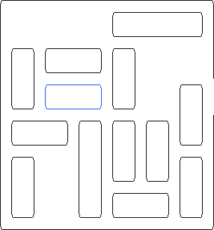
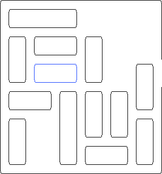
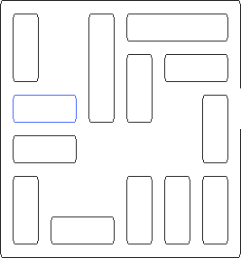

# Projet Rush Hour

Le but de ce projet est d'écrire un programme permettant de trouver une
solution au jeu *Rush Hour*.

## Installation  

### Prérequis :  
> C++ 20  
> imagemagick  
> make

```
sudo apt install imagemagick
```

## Compilation  

Pour compiler le programme en mode **DEBUG**
> ```make debug```

Pour compiler le programme en mode **RELEASE**
> ```make release```

Pour générer la **documentation**
> ```make doxy```

## Exécution

Pour exécuter le **main** : 

> ./bin/main

Pour générer des pendant l'exécution du main **GIF**

> ./bin/main --gif

Pour exécuter le main de **test** 

> ./bin/test


## Règles du jeu

Le jeu Rush Hour se joue seul sur une grille carrée de six cases de côté. Sur
cette grille sont répartis des véhicules d'une case de largeur, et de deux ou
trois cases de longueur. Ces véhicules peuvent être placés horizontalement ou
verticalement. Chaque véhicule peut être déplacé en avant ou en arrière, mais
pas latéralement, tant qu'il n'entre pas en collision avec un autre véhicule.
Le but du jeu est de faire sortir l'un des véhicules par une sortie placée sur
le bord du plateau. L'image ci dessous illustre un exemple de partie.


Chaque déplacement de véhicule compte pour un coup, quelle que soit la longueur
du déplacement. La qualité de votre solution dépend donc du nombre de coups
nécessaires depuis la situation initiale pour faire sortir le véhicule.

## Modélisation

La recherche d'une solution au jeu Rush Hour peut être modélisée sous la forme
d'un parcours de graphe. Dans ce graphe, les sommets sont des situations de jeu.
Les arêtes sont des coups. Les deux images qui suivent représentent deux
situations de jeu, et donc deux sommets du graphe. Il est possible de passer
d'une situation à l'autre en déplaçant le long véhicule du haut, elles sont donc
reliées par une arête dans le graphe.


&nbsp;&nbsp;&nbsp;&nbsp;&nbsp;&nbsp;


Votre première tâche pour ce projet consiste à élaborer une structure de données
sous la forme d'une classe pour représenter les situations de jeu, munies de 
méthodes pour accéder de façon pratique aux situations de jeu adjacentes.

Pour vous aider dans l'élaboration de votre structure de données, vous pourrez
utiliser le fait que :

* les véhicules ne sont que de taille deux ou trois
* il n'y a jamais plus de 16 véhicules
* il n'y a toujours qu'un véhicule à sortir

La situation initiale du problème résolu plus haut :



pourra être décrite par [le fichier suivant](Sujet/puzzle.txt) :

```
2 5
2 0 2 1
0 0 2 0
0 2 3 0
0 3 3 1
1 3 2 0
1 4 2 1
2 5 2 0
3 0 2 1
4 0 2 0
4 3 2 0
4 4 2 0
4 5 2 0
5 1 2 1
```
La première ligne correspond à la position de la sortie (ligne 2 colonne 5, on
commence la numérotation à 0), la seconde ligne est la position du véhicule à
sortir (ligne 2, colonne 0, longueur 2, horizontal), les lignes suivantes sont
les autres véhicules, toujours avec le format ligne, colonne, longueur,
horizontal (1) ou vertical (0). Dans le cas d'un véhicule horizontal, la
position donnée est celle de la case la plus à gauche, dans le cas d'un véhicule
vertical, la position donnée est celle de la case la plus haute.

Pour favoriser les échanges, vous pouvez munir votre classe d'un constructeur
prenant un fichier en paramètre, au format décrit ci-dessus, ainsi que d'une
fonction pour exporter votre situation de jeu sous la forme d'un fichier
similaire.

## Parcours

Une fois les situations de jeu représentables, il s'agit maintenant d'instancier
la situation de jeu initiale, et de parcourir le graphe pour trouver une
situation de jeu gagnante, ainsi que les coups permettant de l'atteindre.
Idéalement, le nombre de coups à jouer pour atteindre cette situation de jeu
gagnante devra être minimal. Dans le cas de l'exemple fourni ci-dessus, le code
de votre responsable d'UE a donné une solution en 14 coups. Il est nécessaire de
réaliser un parcours de graphe bien choisi. Il n'est pas ici nécessaire de
générer tout le graphe, mais seulement de partir de la situation de départ, de
lister les situations atteignables en déplaçant des véhicules, et de les ajouter
à votre structure de données gérant les situations de jeu encore à traiter,
selon le type de parcours choisi.

Les situations de jeu sont donc découvertes petit à petit, attention cependant à
faire en sorte que votre exploration n'étudie qu'une fois chaque situation de
jeu, et se rendre compte que certaines situations ont déjà été explorées. Sans
cette attention, votre exploration risquera de tourner en rond entre des
situations de jeu, ou d'en explorer beaucoup trop.

## Élaboration de nouveaux puzzles

Une fois la résolution programmée, et le parcours du graphe compris,
consacrez-vous à la création de nouveaux puzzles. Cette fois, il s'agit de
fournir une situation de départ qui soit intéressante à jouer. La difficulté du
puzzle correspondra au nombre de coups minimal pour le résoudre, et votre but
sera ici de trouver des stratégies pour créer les puzzles les plus difficiles
possibles.

